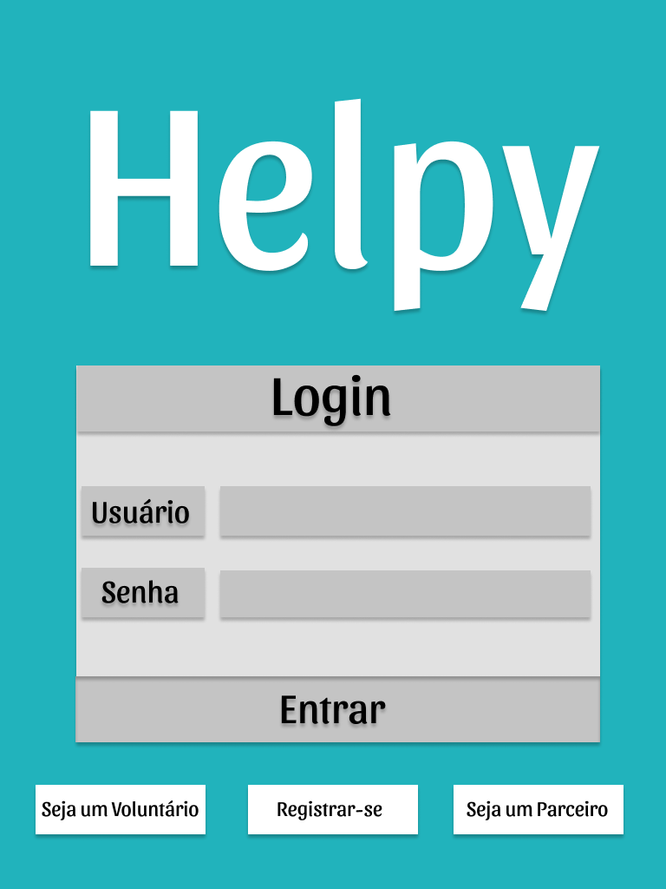
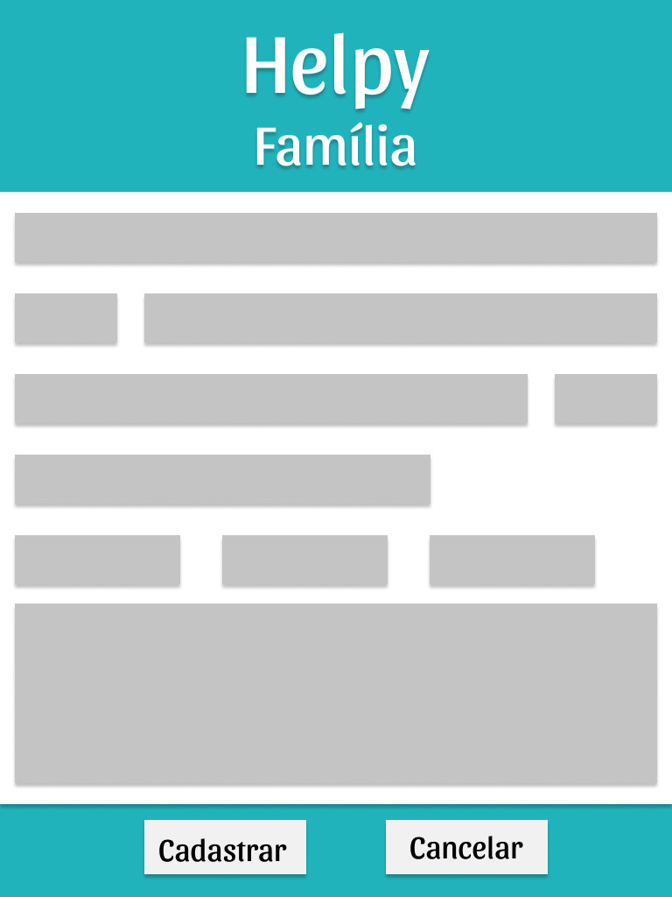

# HELPY - DOCUMENTO DE VISÃO

## Sumário

1. [Introdução](#introdução)
   
2. [Posicionamento](#posicionamento)
   
    2.1. [Declaração do problema](#1-declaração-do-problema)

    2.2. [Declaração da posição do produto](#1-declaração-da-posição-do-produto)

3. [Declaração das partes interessadas](#declaração-das-partes-interessadas)
   
    3.1. [Resumo das partes interessadas](#1-resumo-das-partes-interessadas)

    3.2. [Ambiente do usuário](#2-ambiente-do-usuário)

4. [Visão geral do produto](#visão-geral-do-produto)
   
    4.1. [Necessidades e recursos](#1-necessidades-e-recursos)

5. [Outros requisitos do produto](#outros-requisitos-do-produto)
   
6. [Requisitos funcionais](#requisitos-funcionais)
   
    6.1. [Diagrama de casos de uso](#1-diagrama-de-casos-de-uso)

    6.2. [Especificação de casos de uso](#2-especificação-de-casos-de-uso)

      6.2.1. [Caso de uso Manter Usuario – Mateus Pereira](#1-caso-de-uso-manter-voluntario--mateus-pereira)
          
      6.2.2. [Caso de uso Manter Serviço Ofertado – Ruan Lucas](#2-caso-de-uso-manter-evento--ruan-lucas)
          
      6.2.3. [Caso de uso Manter proposta – Gabriel Alves](#3-caso-de-uso-manter-mantimentos--gabriel-alves)
          
      6.2.4. [Caso de uso Interagir via chat – Luiz Fernando](#4-caso-de-uso-manter-família--luiz-fernando)
          
      6.2.5. [Caso de uso Efetuar pagamento on line – Raniery Azevedo](#5-caso-de-uso-manter-parceria--raniery-azevedo)

7. [Lista de regras de negócio](#lista-de-regras-de-negócio)
   
8.  [Wireframe](#wireframe)

## Introdução

O Helpy é um aplicativo mobile para Android (6.0.1 ou mais) e IOS (10 ou mais) que tem como objetivo
promover eventos de arrecadação e doação de mantimentos para famílias de baixa renda da Ceilândia.

## Posicionamento

### 1. Declaração do problema

|  |  |
| ----------- | ----------- |
| O problema de      | Vulnerabilidade social na pandemia.       |
| Afeta   | Famílias carentes e de baixa renda da Ceilândia.        |
| No qual o impacto é | É redução da renda por conta da diminuição de salários e do aumento do desemprego.   |
| Uma solução de sucesso seria      | Promover ações voluntárias da comunidade, em busca de recursos para famílias carentes.    |

### 1. Declaração da posição do produto

|  |    |
| ----------- | ----------- |
| Para  | Familias da Ceilândia       |
| No qual  | Foram afetadas pelos efeitos da pandemia        |
| O (Helpy) | É um aplicativo.       |
| Que | Busca promover ações beneficentes.   |
| Diferente de |  De outras iniciativas tradicionais.  |
| Nosso produto |  Oferece uma plataforma digital que busca integrar famílias e voluntários de forma eficiente em eventos beneficentes.  |

## Declaração das partes interessadas

### 1. Resumo das partes interessadas

| Nome      | Descrição |
| ----------- | ----------- |
| Voluntário      | Pessoa disposta a participar da organização dos eventos.       |
| Parceiros   | Instituições disposta a ajudar monetariamente.        |
| Doador      | Pessoa com disposição para ajudar o próximo.       |
| Organizador   | Pessoa encarregada de coordenar os eventos beneficentes.Ruan e Raniery.        |
| Desenvolvedores   | Pessoa responsável por cuidar da codificação e desenvolvimento do software em si: Mateus, Gabriel, Luiz Fernando.        |
| Família      | Família que se encontre em situação de vulnerabilidade       |

### 2. Ambiente do usuário

Atualmente, o cenário se descreve de maneira simples: Há famílias as quais se encontram em um
grupo carente da sociedade e há grupos voluntários que se dispõem a oferecer ajuda. Para tal, são
organizados eventos beneficentes na comunidade, onde pessoas dispostas a participar efetuam
doações de mantimentos e os voluntários se responsabilizam pela checagem da qualidade do
produto e entrega aos necessitados.

## Visão geral do produto

### 1. Necessidades e recursos

| Necessidades      | Funcionalidades correspondentes | Responsável |
| ----------- | ----------- | ----------- |
| Manter o registro da entrada e saída de todos os recursos arrecadados de cada evento.      |<ul><li>Incluir mantimento </li><li>Retirar mantimentos </li><li>Listar mantimentos  </li></ul> | Gabriel Alves De Paulo |
| Manter o controle de todos os voluntários envolvidos nas ações comunitárias.|<ul><li>Cadastrar voluntario </li><li>Listar voluntario</li><li>Alterar voluntario  </li><li>Deletar voluntario. </li></ul> | Mateus Pereira De Souza Moreira |
| Manter a organização das etapas nos eventos solidários. A partir do planejamento detalhado de todas as fases(arrecadação/distribuição) da organização do evento, delegando responsabilidades, elegendo prioridades e reservando prazos para evitar aglomerações nas etapas.|<ul><li>Criar evento </li><li>Listar evento</li><li>-Alterar voluntario</li><li>Deletar voluntario</li></ul> | Ruan Lucas Soares do Nascimento |
| Manter o registro de todas as famílias carentes e suas necessidades.|<ul><li>Cadastrar familia</li><li>Listar Familia</li><li>Atualizar familia</li><li>Excluir familia</li></ul> | Luiz Fernando Pereira da Costa |
| Manter o registro das instituições parceiras de cada evento.|<ul><li>Cadastrar parceiros</li><li>Alterar parceiros</li><li>Listar parceiros</li><li>Deletar parceiros</li></ul> | Raniery Pereira Azevedo |

## Outros requisitos do produto

| Requisitos não-funcionais      |
| ----------- |
| RNF 1: O sistema necessitará de um dispositivo que possibilite o acesso a internet (Dados móveis ou Rede WIFI).      |
| RNF 2: O sistema funcionará apenas em dispositivos com Android (6.0.1 ou mais) e IOS (10 ou mais).   |
| RNF 3: O sistema possibilitará a verificação de duas etapas para maior segurança.  |

## Requisitos funcionais

### 1. Diagrama de casos de uso

### 2. Especificação de casos de uso

#### 1. Caso de uso Manter Voluntario – Mateus Pereira

  | CDU-01 |
  | ----------- |

  | Nome do caso de uso: | CADASTRAR VOLUNTARIO |
  | ------------ | ----------- |
  | Ator Principal: | Voluntário |
  | Atores Secundários:| |
  | Descrição:| Este caso de uso permite ao ator, se cadastrar no sistema. |
  | Pré-condições: | O voluntário deve ter acesso a pagina inicial do sistema. |
  | Pós-condições: | Voluntário cadastrado no sistema. |

  | Fluxo Basíco - CADASTRAR VOLUNTARIO |
  | ----------- |

  | | Ações do Ator | Principal: Usuário Ações do Sistema: |
  | ----------- | ----------- | ----------- |
  |1| O caso de uso tem inicio quando o ator clica em cadastre-se, na pagina inicial. | O sistema apresenta um formulário. |
  |2| O ator preenche com seus dados. | O sistema valida e guarda os dados.|
  |3| | O sistema apresenta um formulário para definição de usuário e senha. |
  |4| O ator digita seu usuário e senha. | O sistema valida e guarda senha. |
  |5| | O sistema apresenta a mensagem "Voluntário cadastrado" |
  |6| | O sistema inclui o voluntário na lista de espera de voluntários". |
  |7| | O caso de uso e encerrado. |

  | CDU-02 |
  | ----------- |

  | Nome do caso de uso: | VISUALIZAR VOLUNTARIO |
  | ----------- | ----------- |
  | Ator Principal: | Voluntário |
  | Atores Secundários:| |
  | Descrição: | Este caso de uso permite ao ator, consultar editar e excluir seu perfil. |
  | Pré-condições: | O voluntário deve estar autenticado no sistema. |
  | Pós-condições: | Consulta, edição ou exclusão do perfil. |

  | Fluxo Basíco - VISUALIZAR VOLUNTARIO |
  | ----------- |

  | | Ações do Ator | Principal: Usuário Ações do Sistema: |
  | ----------- | ----------- | ----------- |
  |1| O caso de uso tem inicio na pagina inicial do APP, quando o ator clica em visualizar perfil. |O sistema recupera os dados do usuário.
  |2| | O sistema apresenta os dados do perfil do voluntário. |
  |3| O ator em voltar para pagina inicial.| O caso de uso é encerrado. |

  | FLUXO ALTERNATIVO 1 – EDITAR VOLUNTÁRIO |
  | ----------- |

  | | Ações do Ator | Principal: Usuário Ações do Sistema: |
  | ----------- | ----------- | ----------- |
  |1| 2 – O ator clica em editar perfil. | O sistema recupera os dados. |
  |2| | O sistema apresenta um formulário para edição de dados. |
  |3| O ator modifica os campos que deseja alterar. | O sistema valida e guarda os dados. |
  |4|  | O sistema apresenta a mensagem "Voluntário alterado. |

  | FLUXO ALTERNATIVO 2 – EXCLUIR VOLUNTÁRIO |
  | ----------- |

  | | Ações do Ator | Principal: Usuário Ações do Sistema: |
  | ----------- | ----------- | ----------- |
  |1| 2 – O ator clica em excluir perfil. | O sistema recupera os dados. |
  |2| | O sistema apresenta um POPUP,perguntando se deseja mesmo excluir o perfil. |
  |3| O ator clica em sim, desejo excluir o meu perfil. | O sistema apresenta um CHECKBOX com os possíveis motivos, e caixa de texto, caso queira relatar outros motivos. |
  |4| | O sistema valida e guarda os motivos da exclusão e solicita novamente autenticação para exclusão.|
  |5| O ator se autentica. | O sistema valida a autenticação. |
  |6| | O sistema exclui o voluntário. O sistema apresenta a mensagem “Voluntário excluído”. |
  |7| |O caso de uso é encerrado.|

#### 2. Caso de uso Manter Evento – Ruan Lucas

  | CDU-01 |
  | ----------- |

  | Nome do caso de uso: | MANTER EVENTO |
  | ----------- | ----------- |
  | Ator Principal: | Organizador |
  | Atores Secundários:| Voluntário |
  | Descrição: | Descreve os passos para que o Organizador possa criar, listar, atualizar ou excluir um evento. |
  | Pré-condições: | Ambos os atores devem estar cadastrados no sistema. Apenas o Organizador pode criar eventos. |
  | Pós-condições: | Apresentar mensagens de conclusão de acordo com a função desejada. |

  | Fluxo Basíco – CRIAR EVENTO|
  | ----------- |

  | | Ações do Ator | Principal: Usuário Ações do Sistema: |
  | ----------- | ----------- | ----------- |
  |1| Efetuar login no sistema. | Validar dados de login. |
  |2| Clicar em “Eventos”. | Apresentar tela com a sessão“Eventos”. |
  |3| Clicar em “Criar evento”. | Apresentar formulário para preenchimento dos dados do evento. |
  |4| Digitar os dados e clicar em “Criar”. | Salvar os dados no banco de dados. |
  |5|  | Retornar para a tela com a sessão “Eventos”. |
  |6|  | Apresentar mensagem de “Evento criado com sucesso”. |
  

  | FLUXO ALTERNATIVO – CANCELAR CRIAÇÃO DE EVENTO |
  | ----------- |

  | | Ações do Ator | Principal: Usuário Ações do Sistema: |
  | ----------- | ----------- | ----------- |
  |1| Efetuar login no sistema. | Validar dados de login. |
  |2| Clicar em “Eventos”. | Apresentar tela com a sessão “Eventos”. |
  |3| Clicar em “Criar evento”. | Apresentar formulário para preenchimento dos dados do evento. |
  |4| Digitar os dados e clicar em “Cancelar”. | Retornar para a tela com a sessão “Eventos”. |
  

  | Fluxo Basíco 2 – LISTAR EVENTO |
  | ----------- |

  | | Ações do Ator | Principal: Usuário Ações do Sistema: |
  | ----------- | ----------- | ----------- |
  |1| Efetuar login no sistema. | Validar dados de login. |
  |2| Clicar em “Eventos”. | Apresentar tela com a sessão“Eventos” |
  |3| Pesquisar código do evento ou rolar a página para visualizar todos os eventos. | Apresentar lista de eventos criados ou evento específico de acordo com o código digitado. |

  | Fluxo Básico 3 – ATUALIZAR EVENTO|
  | ----------- |

  | | Ações do Ator | Principal: Usuário Ações do Sistema: |
  | ----------- | ----------- | ----------- |
  |1| Efetuar login no sistema. | Validar dados de login. |
  |2| Clicar em “Eventos”. | Apresentar tela com a sessão“Eventos”. |
  |3| Pesquisar código do evento ou rolar a página para visualizar todos os eventos. | Apresentar lista de eventos criados ou evento específico de acordo com o código digitado. |
  |4| Encontrar o evento desejado e clicar em “Atualizar”. |Apresentar formulário para atualização dos dados do evento. |
  |5| Digitar os dados e clicar em “Salvar”. | Salvar os dados no banco de dados. |
  |6|  | Retornar para a tela com a sessão “Eventos”. |
  |7|  | Apresentar mensagem de “Evento atualizado com sucesso.” |

  | FLUXO ALTERNATIVO  – CANCELAR ATUALIZAÇÃO DE EVENTO |
  | ----------- |

  | | Ações do Ator | Principal: Usuário Ações do Sistema: |
  | ----------- | ----------- | ----------- |
  |1| Efetuar login no sistema. | Validar dados de login. |
  |2| Clicar em “Eventos”. | Apresentar tela com a sessão “Eventos”. |
  |3| Pesquisar código do evento ou rolar a página para visualizar todos os eventos | Apresentar lista de eventos criados ou evento específico de acordo com o código digitado. |
  |4| Encontrar o evento desejado e clicar em “Atualizar”. | Apresentar formulário para atualização dos dados do evento. |
  |5| Digitar os dados e clicar em “Cancelar”. | Retornar para a tela com a sessão “Eventos”. |

  | Fluxo básico 4 – EXCLUIR EVENTO |
  | ----------- |

  | | Ações do Ator | Principal: Usuário Ações do Sistema: |
  | ----------- | ----------- | ----------- |
  |1| Efetuar login no sistema. | Validar dados de login. |
  |2| Clicar em “Eventos”. | Apresentar tela com a sessão“Eventos”. |
  |3| Pesquisar código do evento ou rolar a página para visualizar todos os eventos. | Apresentar lista de eventos criados ou evento específico de acordo com o código digitado. |
  |4| Encontrar o evento desejado e clicar em “Excluir”. | Apresentar mensagem de confirmação de exclusão. |
  |5| Clicar em “Excluir”. | Excluir os dados do banco de dados. |
  |6|  | Retornar para a tela com a sessão “Eventos”. |
  |7|  | Apresentar mensagem de “Evento excluído com sucesso.” |

  | FLUXO ALTERNATIVO  – CANCELAR EXCLUSÃO DE EVENTO |
  | ----------- |

  | | Ações do Ator | Principal: Usuário Ações do Sistema: |
  | ----------- | ----------- | ----------- |
  |1| Efetuar login no sistema. | Validar dados de login. |
  |2| Clicar em “Eventos”. | Apresentar tela com a sessão “Eventos”. |
  |3| Pesquisar código do evento ou rolar a página para visualizar todos os eventos | Apresentar lista de eventos criados ou evento específico de acordo com o código digitado. |
  |4| Encontrar o evento desejado e clicar em “Excluir”. | Apresentar mensagem de confirmação de exclusão. |
  |5| Clicar em “Cancelar”. | Retornar para a tela com a sessão “Eventos” |

#### 3. Caso de uso Manter Mantimentos – Gabriel Alves

  | CDU-01 |
  | ----------- |

  | Nome do caso de uso: | INCLUIR MANTIMENTOS |
  | ----------- | ----------- |
  | Ator Principal: | Voluntário, organizador |
  | Atores Secundários:|  |
  | Descrição: | O ator adiciona todos os mantimentos arrecadados pelo evento no sistema. |
  | Pré-condições: | O ator deve estar logado no sistema, e na página de estoque do evento |
  | Pós-condições: | O êxito na inclusão do mantimento no sistema. |

  | Fluxo Basíco - INCLUIR MANTIMENTOS |
  | ----------- |

  | | Ações do Ator | Principal: Usuário Ações do Sistema: |
  | ----------- | ----------- | ----------- |
  |1| O ator aciona “Mostrar Estoque do evento” |  |
  |2|  | O sistema exibe a área de estoque. |
  |3| O ator aciona o botão “Adicionar mantimentos” | |
  |4|  | O sistema exibe o formulário para o ator . |
  |5| O ator preenche todos os campos do formulário. |  |
  |6| O ator aciona o botão “Adicionar mantimentos”. |  |
  |7|  | O sistema envia uma mensagem de confirmação “Você deseja incluir esses mantimentos?” |
  |8| O ator aciona a opção “Sim” |  |
  |9|  | O sistema valida os dados preenchidos anteriormente pelo ator . |
  |10|  | O sistema encaminha o formulário preenchido ao banco de dados do sistema. |
  |11|  | O sistema exibe a mensagem para o ator “Mantimentos adicionados com sucesso”|
  |12|  | O sistema encaminha o ator para página de listagem de mantimentos. |

  | Fluxo alternativo 1 – REENVIAR INCLUIR MANTIMENTOS |
  | ----------- |

  | | Ações do Ator | Principal: Usuário Ações do Sistema: |
  | ----------- | ----------- | ----------- |
  |1| O ator aciona “Mostrar Estoque do evento”. |  |
  |2|  | O sistema exibe a área de estoque. |
  |3| O ator aciona o botão “Adicionar mantimentos”. |  |
  |4|  | O sistema exibe o formulário para o ator . |
  |5| O ator preenche todos os campos do formulário. |  |
  |6| O ator aciona o botão “Adicionar mantimentos”. |  |
  |7|  | O sistema envia uma mensagem de confirmação “Você deseja incluir esses mantimentos?” |
  |8| O ator aciona a opção “Sim”. |  |
  |9|  | O sistema valida os dados preenchidos anteriormente pelo ator . |
  |10|  | Caso exista algum campo em branco o sistema exibe uma mensagem “Campos obrigatórios não preenchidos”. |
  |11|  | O sistema exibe novamente o formulário junto com a mensagem. |
  |12| O ator preenche os dados que estão faltando e envia novamente o formulário. |  |
  |13|  | O sistema valida os dados preenchidos anteriormente pelo ator . |
  |14|  | O sistema encaminha o formulário preenchido ao banco de dados do sistema. |
  |15|  | O sistema exibe a mensagem para o ator “Mantimentos adicionados com sucesso”. |
  |16|  | O sistema encaminha o ator para página de listagem de mantimentos. |

  | CDU-02 |
  | ----------- |

  | Nome do caso de uso: | RETIRAR MANTIMENTOS |
  | ----------- | ----------- |
  | Ator Principal: | Voluntário, organizador |
  | Atores Secundários:| |
  | Descrição: | A Retirada mantimentos do estoque do evento |
  | Pré-condições: | O ator deve estar logado e na página de estoque |
  | Pós-condições: | O êxito na retirada dos mantimentos. |

  | Fluxo Basíco - RETIRAR MANTIMENTOS |
  | ----------- |

  | | Ações do Ator | Principal: Usuário Ações do Sistema: |
  | ----------- | ----------- | ----------- |
  |1| O ator aciona Listagem de mantimentos. |  |
  |2|  | O sistema exibe a lista de mantimentos que estão cadastrados no sistema . |
  |3| O ator aciona o botão "Retirar mantimentos". |  |
  |4|  | O sistema exibe um formulário de seleção. |
  |5|  | O ator seleciona os mantimentos que deseja retirar. |
  |6| O ator aciona o botão “Realizar retirada” . |  |
  |7|  | O sistema exibe ‘você deseja realmente quer retirar esses mantimentos?”. |
  |8| O ator aciona “Sim”.  | |
  |9|  | O sistema faz a alteração no banco de dados. |
  |10|  | O sistema exibe uma mensagem “Mantimentos retirados com sucesso”. |
  |11| O sistema encaminha o ator para página de listagem de mantimentos. |

  | Fluxo alternativo 1 – Cancelar retirada de mantimentos |
  | ----------- |

  | | Ações do Ator | Principal: Usuário Ações do Sistema: |
  | ----------- | ----------- | ----------- |
  |1| O ator aciona Listagem de mantimentos. |  |
  |2|  | O sistema exibe a lista de mantimentos que estão cadastrados no sistema. |
  |3| O ator aciona o botão “Retirar mantimentos”. |  |
  |4|  | O sistema exibe um formulário de seleção. |
  |5| O ator seleciona os mantimentos que deseja retirar. |  |
  |6| O ator aciona o botão “Realizar retirada” . |  |
  |7|  | O sistema exibe ‘você deseja realmente quer retirar esses mantimentos?”. |
  |8| O ator aciona “Não” . |  |
  |9|  | O sistema encaminha o organizador para página de listagem de mantimentos. |

  | CDU-03 |
  | ----------- |

  | Nome do caso de uso: | LISTAR MANTIMENTOS |
  | ----------- | ----------- |
  | Ator Principal: | Voluntario,Organizador |
  | Atores Secundários:| |
  | Descrição: | Listagem dos mantimentos cadastrados no sistema. |
  | Pré-condições: | O Ator deve estar logado no sistema e na aba do evento. |
  | Pós-condições: | Apresentação de todos os mantimentos que estão no estoque do evento. |

  | Fluxo Basíco - LISTAR MANTIMENTOS |
  | ----------- |

  | | Ações do Ator | Principal: Usuário Ações do Sistema: |
  | ----------- | ----------- | ----------- |
  |1| O ator aciona “Mostrar mantimentos do evento” |  |
  |2|  | O sistema exibe todos os mantimentos cadastrados posteriormente |
  |3| O ator visualiza os mantimentos disponíveis. |  |
  |4| O ator aciona “fechar janela” |  |
  |5| | O sistema encaminha o ator para a página principal do evento.  |

 
  
#### 4. Caso de uso Manter Família – Luiz Fernando

  | CDU-01 |
  | ----------- |

  | Nome do caso de uso: | CADASTRAR FAMÍLIA |
  | ----------- | ----------- |
  | Ator Principal: | Família |
  | Atores Secundários:| Voluntários |
  | Descrição: | Cadastrar as famílias carentes e suas necessidades. |
  | Pré-condições: | A família ou voluntário deve acessar o sistema, especificamente na página de cadastro das famílias, podendo detalhar ou não as necessidades de cada família, no ato de preenchimento do formulário. |
  | Pós-condições: | A família ou voluntário recebe uma notificação: Cadastro feito com sucesso e uma chave de acesso. |

  | FLUXO BÁSICO - CADASTRAR FAMÍLIA |
  | ----------- |

  | | Ações do Ator | Principal: Usuário Ações do Sistema: |
  | ----------- | ----------- | ----------- |
  |1| A família acessa a página de cadastro.  | O sistema exibe o formulário para a família. |
  |2| Preencher o formulário de cadastro das famílias.  |  |
  |3|  | O sistema exibe um campo para detalhar alguma necessidade especial. |
  |4| Detalhar alguma necessidade especial, caso exista.  |  |
  |5| A família clica no botão enviar.  | O sistema valida os dados preenchidos anteriormente pela família. |
  |6|  | O sistema encaminha o formulário preenchido ao banco de dados do sistema. |
  |7|  | O sistema gera um chave individual para cada família. |
  |8|  | O sistema volta para a página inicial. |

   | CDU-02 |
  | ----------- |

  | Nome do caso de uso: | LISTAR FAMÍLIA |
  | ----------- | ----------- |
  | Ator Principal: | Família |
  | Atores Secundários:| Voluntários |
  | Descrição: | Fornecer às famílias a posição em que elas se encontram na lista de espera. |
  | Pré-condições: | A família ou voluntário deve estar logado no sistema com a chave de acesso que foi fornecida anteriormente. |
  | Pós-condições: | A família ou voluntário recebe uma lista de espera. |

  | FLUXO BÁSICO - LISTAR FAMÍLIA |
  | ----------- |

  | | Ações do Ator | Principal: Usuário Ações do Sistema: |
  | ----------- | ----------- | ----------- |
  |1| A família ou voluntário acessa a página de login.  |  |
  |2| A família ou voluntário clica no botão em fazer login.  | O sistema solicita a chave de acesso. |
  |3| A família ou voluntário faz o login.  | O sistema exibe a opção Listar Família para a família ou voluntário. |
  |4| A família ou voluntário clica em Listar Família. |  |
  |5|   | O sistema exibe uma lista de espera com a posição de cada família. |
  |6| A família ou voluntário clica no botão fechar. | O sistema volta para a página inicial. |
  

  | CDU-03 |
  | ----------- |

  | Nome do caso de uso: | ATUALIZAR CADASTRO |
  | ----------- | ----------- |
  | Ator Principal: | Família |
  | Atores Secundários:| Voluntários |
  | Descrição: | Alteração dos dados feito no ato do cadastro. |
  | Pré-condições: | A família ou voluntário deve estar logado no sistema com a chave de acesso que foi fornecida anteriormente. |
  | Pós-condições: | A família ou voluntário recebe uma notificação: Cadastro atualizado com sucesso. |

  | FLUXO BÁSICO - ATUALIZAR CADASTRO |
  | ----------- |

  | | Ações do Ator | Principal: Usuário Ações do Sistema: |
  | ----------- | ----------- | ----------- |
  |1| A família ou voluntário acessa a página de cadastro.  |  |
  |2|  A família ou voluntário clica no botão em fazer login.  | O sistema solicita a chave de acesso.  |
  |3|  | O sistema exibe o formulário para a família ou voluntário. |
  |4| A família ou voluntário clica em atualizar o formulário de cadastro das famílias.  |  |
  |5| Detalhar alguma necessidade especial, caso exista.  | O sistema exibe um campo para detalhar alguma necessidade especial. |
  |6| A família ou voluntário clica no botão enviar. | O sistema valida os dados preenchidos anteriormente pela a família ou voluntário. |
  |7|  | O sistema encaminha o formulário preenchido ao banco de dados do sistema. |
  |8|  | O sistema volta para a página inicial. |

  | CDU-04 |
  | ----------- |

  | Nome do caso de uso: | EXCLUIR FAMÍLIA |
  | ----------- | ----------- |
  | Ator Principal: | Família |
  | Atores Secundários:| Voluntários |
  | Descrição: | Excluir o cadastro no sistema. |
  | Pré-condições: | A família ou voluntário deve estar logado no sistema com a chave de acesso que foi fornecida anteriormente. |
  | Pós-condições: | A família ou voluntário recebe uma notificação: Cadastro excluído com sucesso. |

  | FLUXO BÁSICO - EXCLUIR FAMÍLIA |
  | ----------- |

  | | Ações do Ator | Principal: Usuário Ações do Sistema: |
  | ----------- | ----------- | ----------- |
  |1| A família ou voluntário acessa a página de login.  |  |
  |2|  A família ou voluntário clica no botão em fazer login. | O sistema solicita a chave de acesso.  |
  |3|  | O sistema exibe a opção “excluir cadastro” para a família ou voluntário. |
  |4| A família ou voluntário clica em excluir cadastro.  |  |
  |5| A família ou voluntário confirma. | |
  |6|  | O sistema exibe uma mensagem: Tem certeza que deseja excluir o cadastro? |
  |7|  | O sistema exibe uma mensagem: Cadastro excluído! |
  |8|  | O sistema volta para a página inicial. |

#### 5. Caso de uso Manter Parceria – Raniery Azevedo

  | CDU-01 |
  | ----------- |

  | Nome do caso de uso: | INCLUIR PARCERIA |
  | ----------- | ----------- |
  | Ator Principal: | Organizador |
  | Atores Secundários:|  |
  | Descrição: | O organizador do evento adiciona uma empresa que deseja fazer uma parceria patrocinando um evento. |
  | Pré-condições: | O organizador deve estar logado no sistema na aba para adicionar parceria. |
  | Pós-condições: | O êxito na inclusão do parceiro no sistema. |

  | FLUXO BÁSICO – Incluir Parceria |
  | ----------- |

  | | Ações do Ator | Principal: Usuário Ações do Sistema: |
  | ----------- | ----------- | ----------- |
  |1|  | O sistema exibe a área de parceria. |
  |2| O organizador aciona o botão “Adicionar parceiros”. | Autoriza a entrada. |
  |3|  | O sistema exibe o formulário para o organizador. |
  |4| O organizador preenche todos os campos do formulário. |  |
  |5| O cliente aciona o botão “Adicionar parceiros”. | Mostra valor digitado. |
  |6|  | O sistema envia uma mensagem de confirmação “Você deseja incluir esse parceiro/patrocinador?” |
  |7| O Organizador aciona a opção “Sim”. | |
  |8|  | O sistema valida os dados preenchidos anteriormente pelo Organizador. |
  |9|  | O sistema encaminha o formulário preenchido ao banco de dados do sistema |
  |10|  | O sistema exibe a mensagem para o cliente “Parceiro adicionado com exito”. |
  |11|  | O sistema encaminha o Organizador para página inicial do evento. |

  | FLUXO ALTERNATIVO – Empresa Já Cadastrada |
  | ----------- |

  | | Ações do Ator | Principal: Usuário Ações do Sistema: |
  | ----------- | ----------- | ----------- |
  |1| | O sistema exibe a área de parceiros.  |
  |2| O organizador aciona o botão “Adicionar parceria”. | Caso login esteja errado, solicita novamente. |
  |3|  | O sistema exibe o formulário para o organizador.|
  |4| O organizador preenche todos os campos do formulário. |  |
  |5| O cliente aciona o botão “Adicionar parceiro”. | |
  |6|  | O sistema envia uma mensagem de confirmação “Você deseja adicionar esse parceiro?”. |
  |7| O Organizador aciona a opção “Sim”. |  |
  |8|  | O sistema valida os dados preenchidos anteriormente pelo Organizador. |
  |9|  | Caso exista algum campo em branco o sistema exibe uma mensagem “Campos obrigatórios não preenchidos”. |
  |10|  | O sistema exibe novamente o formulário junto com a mensagem. |
  |11| O Organizador preenche os dados que estão faltando e envia novamente o formulário.  |  |
  |12|  | O sistema valida os dados preenchidos anteriormente pelo Organizador. |
  |13|  | O sistema exibe uma mensagem: “Parceiro já cadastrado!”. |
  |14|  | O sistema encaminha o organizador para página principal do evento. |

  | CDU-02 |
  | ----------- |

  | Nome do caso de uso: | EXCLUIR PARCEIRO|
  | ----------- | ----------- |
  | Ator Principal: | Organizador |
  | Atores Secundários:|  |
  | Descrição: | Excluir um parceiro que não queira mais fazer parte de eventos. |
  | Pré-condições: | O organizador deve estar logado e na página de parceria. |
  | Pós-condições: | O êxito na exclusão do parceiro. |

  | FLUXO BÁSICO – Excluir Parceiro |
  | ----------- |

  | | Ações do Ator | Principal: Usuário Ações do Sistema: |
  | ----------- | ----------- | ----------- |
  |1|  | O sistema exibe a lista de parceiros que estão cadastrados no sistema. |
  |2| O Organizador aciona o botão “excluir parceiro”. |  |
  |3|  | O sistema exibe um formulário de seleção. |
  |4| O Organizadorseleciona o parceiro que deseja excluir. |  |
  |5| O Organizador aciona o botão “Excluir parceiro”. |  |
  |6|  | O sistema exibe ‘você deseja realmente excluir esse parceiro? |
  |7| O Organizador aciona a opção “Sim”. | |
  |8|  | O sistema faz a alteração no banco de dados. |
  |9|  | O sistema exibe uma mensagem “Parceiro excluído com sucesso”. |
  |10|  | O sistema encaminha o organizador para página principal do evento. |
  

  | FLUXO ALTERNATIVO – Excluir Parceiro Errado. |
  | ----------- |

  | | Ações do Ator | Principal: Usuário Ações do Sistema: |
  | ----------- | ----------- | ----------- |
  |1|  | O sistema exibe a lista de parceiros que estão cadastrados no sistema. |
  |2| O Organizador aciona o botão “excluir parceiro”. |  |
  |3|  | O sistema exibe um formulário de seleção. |
  |4| O Organizador seleciona o parceiro que deseja excluir. |  |
  |5| O Organizador aciona o botão “excluir parceiro”. |  |
  |6|  | O sistema exibe ‘você deseja realmente excluir esse parceiro?”  |
  |7| O organizador verifica que selecionou o parceiro errado.  |  |
  |8| O organizador seleciona “Não” | |
  |9|  | O sistema retorna para o formulário de seleção. |
  |10| O Organizador seleciona o parceiro correto |  |
  |11|  | O sistema exibe ‘você deseja realmente excluir esse parceiro?”. |
  |12| O organizador seleciona “Sim”  |  |
  |13|  | O sistema faz a alteração no banco de dados |
  |14|  | O sistema exibe uma mensagem “Parceiro excluído com sucesso”. |
  |15|  | O sistema encaminha o organizador para página principal do evento. |

  | CDU-03 |
  | ----------- |

  | Nome do caso de uso: | LISTAR PARCEIRO|
  | ----------- | ----------- |
  | Ator Principal: | Voluntario,Organizador |
  | Atores Secundários:|  |
  | Descrição: | Listagem dos parceiros cadastrados no sistema para determinado evento. |
  | Pré-condições: | O Ator deve estar logado no sistema e na aba do evento. |
  | Pós-condições: | Apresentação de todos os parceiros que estão patrocinando o evento. |

  | FLUXO BÁSICO – Lista Parceiro |
  | ----------- |

  | | Ações do Ator | Principal: Usuário Ações do Sistema: |
  | ----------- | ----------- | ----------- |
  |1| O ator aciona “Mostrar parceiros do evento”  |  |
  |2|  | O sistema exibe todos os parceiros cadastrados no evento.  |
  |3| O ator visualiza os parceiros do evento. |  |
  |4| O ator aciona “fechar janela”. |  |
  |5| | O sistema encaminha o ator para a página principal do evento. |
  
  
## Lista de regras de negócio

| Regras de negócio |
| ----------- |
| RN1: O organizador ou beneficiário deve manter o cadastro atualizado. |
| RN2: O sistema possibilitará a verificação de duas etapas para maior segurança. |

## Wireframe

|  |  |  |  |
| ----------- | ----------- | ----------- | ----------- |
|  |  |  |  |
|  |  |  |  |
|  | 

## Autores

<table>
  <tr>
    <td align="center">
      <a href="https://www.linkedin.com/in/gabriel-alves-de-paulo">
         
        
          <b>Gabriel Alves</b>
        
      </a>
    </td>
    <td align="center">
      <a href="https://www.linkedin.com/in/luiz-fernando-pereira-da-costa-57b678207/">
         
        
          <b>Luiz Fernando</b>
        
      </a>
    </td>
    <td align="center">
      <a href="https://www.linkedin.com/in/mateus-pereira-de-souza-moreira/">
         
        
          <b>Mateus Pereira</b>
        
      </a>
    </td>
    <td align="center">
      <a href="https://www.linkedin.com/in/raniery-azevedo-628945162/">
         
        
          <b>Raniery Pereira</b>
        
      </a>
    </td>
    <td align="center">
      <a href="https://www.linkedin.com/in/ruan-lucas-soares-do-nascimento-570543206/">
         
        
          <b>Ruan Lucas</b>
        
      </a>
    </td>
  </tr>  
</table>

## Orientador

<table>
  <tr>
    <td align="center">
      <a href="https://www.linkedin.com/in/andr%C3%A9-gustavo-bastos-lima-a1b344187/">
         
        
          <b>André Gustavo</b>
        
      </a>
    </td>
  </tr>  
</table>

## Referências

 - PRESSMAN, Roger. Engenharia de software. 8. Porto Alegre AMGH 2016
 - GUEDES, Gilleanes. UML 2 GUIA PRÁTICO. 2a Edição. São Paulo Novatec Editora 2014 
 - LUCIDCHART. O que é um Diagrama de Implantação. Disponivel em: <https://www.lucidchart.com/pages/pt/o-que-e-diagrama-de-implementacao-uml> Acesso em: 27/10/2020
 - FOWLER, Martin. UML essencial um breve guia para linguagem padrão. 3a Edição. Porto Alegre Bookman 2011
 - TOMAS, Anderson. O modelo 4 + 1. Disponivel:<http://tassinfo.com.br/orientacao-a-objeto/o-modelo-4-1/> Acesso: 15/17/2020
 - Material de apoio do Prof. André Gustavo Bastos Lima

## Licença

Esse projeto está sob licença. Veja o arquivo [LICENÇA](LICENSE.md) para mais detalhes.

## Obrigado!
